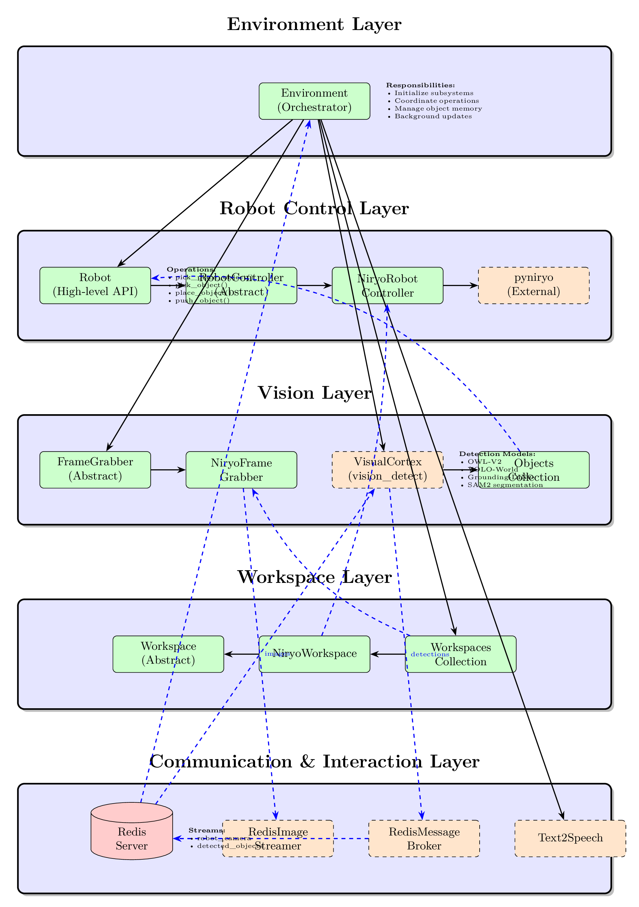

# Robot Environment Architecture Documentation

This document describes the architectural design of the `robot_environment` package, detailing component interactions, data flows, and integration with external packages.

## Overview

The `robot_environment` package provides a comprehensive framework for robotic pick-and-place operations with vision-based object detection. The architecture follows a layered design with clear separation of concerns:

1. **Environment Layer** - Central orchestrator
2. **Robot Control Layer** - Hardware abstraction and motion control
3. **Camera Layer** - Image acquisition and streaming
4. **Workspace Layer** - Coordinate transformation and workspace management
5. **Communication Layer** - Redis-based data streaming
6. **Interaction Layer** - Text-to-speech feedback

**Note:** Object detection is handled by a **separate process** (`vision_detect_segment`) that communicates via Redis streams.

## System Architecture



```
┌─────────────────────────────────────────────────────────────┐
│                    Environment Layer                        │
│  (Central orchestrator coordinating all subsystems)         │
└─────────────────────────────────────────────────────────────┘
                            │
        ┌───────────────────┼───────────────────┐
        │                   │                   │
┌───────▼────────┐   ┌──────▼──────┐   ┌────────▼─────────┐
│  Robot Control │   │   Camera    │   │    Workspace     │
│     Layer      │   │    Layer    │   │      Layer       │
└────────────────┘   └─────────────┘   └──────────────────┘
        │                   │                   │
┌───────▼────────┐   ┌──────▼──────┐   ┌────────▼─────────┐
│ RobotController│   │FrameGrabber │   │    Workspace     │
│   (Abstract)   │   │  (Abstract) │   │   (Abstract)     │
└────────────────┘   └─────────────┘   └──────────────────┘
        │                   │                   │
┌───────▼────────┐   ┌──────▼──────┐   ┌────────▼─────────┐
│ NiryoRobot     │   │ NiryoFrame  │   │ NiryoWorkspace   │
│  Controller    │   │   Grabber   │   │                  │
└────────────────┘   └─────────────┘   └──────────────────┘
                            │
                    ┌───────▼───────┐
                    │ Redis Streams │
                    │  (Images +    │
                    │   Objects)    │
                    └───────┬───────┘
                            │
                    ┌───────▼───────┐
                    │ vision_detect │
                    │   _segment    │
                    │ (Separate     │
                    │  Process)     │
                    └───────────────┘
```

## Core Components

### Environment Layer
- `Environment` - Central orchestrator managing all subsystems
- Coordinates camera updates, object retrieval, and robot control
- Manages object memory with workspace-aware tracking
- Handles thread-safe operations with proper locking

### Robot Control Layer
- `Robot` - High-level robot API implementing pick-and-place operations
- `RobotController` - Abstract base class for hardware control
- `NiryoRobotController` - Niryo Ned2 implementation with pyniryo
- `WidowXRobotController` - WidowX implementation with InterbotixManipulatorXS

### Camera Layer
- `FrameGrabber` - Abstract camera interface with Redis streaming
- `NiryoFrameGrabber` - Niryo-mounted camera with undistortion
- `WidowXFrameGrabber` - Intel RealSense integration (stub)
- **External**: Object detection via `vision_detect_segment` package (separate process)

### Workspace Layer
- `Workspace` - Abstract workspace with coordinate transformation
- `NiryoWorkspace` - Niryo-specific workspace implementation
- `Workspaces` - Collection managing multiple workspaces

### Object Representation
- `Object` - Detected object with full spatial information
- `Objects` - Collection with spatial queries and filtering
- `PoseObjectPNP` - 6-DOF pose representation

### Communication Layer (Redis-based)
- `RedisImageStreamer` - Variable-size image streaming (from `redis_robot_comm`)
- `RedisMessageBroker` - Object detection results consumption (from `redis_robot_comm`)
- `RedisLabelManager` - Dynamic object label configuration (from `redis_robot_comm`)

For detailed architecture documentation, see **[docs/README.md](docs/README.md)**

---

## Data Flow Architecture

### Complete Pick-and-Place Workflow

```
1. INITIALIZATION
   Environment (robot_environment process)
      ├─→ Robot → RobotController (connects to hardware)
      ├─→ FrameGrabber (initializes camera)
      ├─→ Workspaces (loads workspace definitions)
      └─→ Redis Communication (RedisMessageBroker, RedisLabelManager)

   Separate Process: vision_detect_segment
      └─→ VisualCortex (loads detection models)

2. OBSERVATION
   Robot.move2observation_pose(workspace_id)
      └─→ RobotController.move2observation_pose()
          └─→ Gripper moves to hover above workspace

3. IMAGE CAPTURE & STREAMING
   FrameGrabber.get_current_frame()
      ├─→ Capture image from camera
      ├─→ Undistort image
      ├─→ Extract workspace region
      └─→ RedisImageStreamer.publish_image()
              └─→ Redis: 'robot_camera' stream

4. OBJECT DETECTION (SEPARATE PROCESS)
   vision_detect_segment VisualCortex
      ├─→ Read from Redis stream 'robot_camera'
      ├─→ Run detection model (OWL-V2, YOLO-World, YOLOE, etc.)
      ├─→ Optional: Track objects with persistent IDs
      ├─→ Optional: Segment objects (SAM2, FastSAM)
      └─→ Publish results to Redis 'detected_objects' stream

5. OBJECT RETRIEVAL
   Environment.get_detected_objects()
      ├─→ RedisMessageBroker.get_latest_objects()
      ├─→ Read from Redis stream 'detected_objects'
      ├─→ Deserialize JSON
      └─→ Convert to Object instances
              ├─→ Calculate world coordinates
              ├─→ Determine object orientation (for gripper rotation)
              └─→ Store in Objects collection

6. PICK OPERATION
   Robot.pick_object(label, coordinate)
      ├─→ Find nearest object with label
      ├─→ Text2Speech: "Going to pick {label}"
      └─→ RobotController.robot_pick_object(pose)
              ├─→ Lock acquired
              ├─→ Move to pre-grasp pose
              ├─→ Move to grasp pose (z_offset applied)
              ├─→ Close gripper
              ├─→ Lift object
              └─→ Lock released

7. PLACE OPERATION
   Robot.place_object(coordinate, location)
      ├─→ Calculate placement pose
      │   └─→ Apply location offset (LEFT_NEXT_TO, ABOVE, etc.)
      ├─→ Text2Speech: "Going to place at {coordinate}"
      └─→ RobotController.robot_place_object(pose)
              ├─→ Lock acquired
              ├─→ Move to pre-place pose
              ├─→ Move to place pose (z_offset=0.005m)
              ├─→ Open gripper
              ├─→ Retract
              └─→ Lock released
```

### Continuous Camera Update Loop

```
Background Thread (daemon) in robot_environment:
    Loop:
        1. Move to observation pose (if not in motion)
        2. Capture frame → Redis stream 'robot_camera'
        3. Wait 0.1s
        4. (vision_detect_segment detects in parallel)
        5. Get detected objects from Redis 'detected_objects'
        6. Update memory
        7. Sleep (0.25s or 0.5s depending on robot motion)
```

**Note:** Object detection happens in a **separate process** (`vision_detect_segment`), which continuously monitors the `robot_camera` Redis stream and publishes results to `detected_objects`.

## Thread Safety

### Critical Sections

1. **Robot Operations**
   - All `RobotController` methods use `self._lock`
   - Prevents concurrent hardware commands
   - Essential for Niryo robot (not thread-safe API)

2. **Camera Updates**
   - Background thread for continuous updates
   - Daemon thread (terminates with main program)
   - Uses `_stop_event` for clean shutdown

3. **Text-to-Speech**
   - Asynchronous threads for non-blocking speech
   - Thread returned for synchronization if needed

### Example - Thread-Safe Robot Access

```python
def get_target_pose_from_rel(self, ws_id, u_rel, v_rel, yaw):
    with self._lock:  # Thread-safe section
        try:
            obj_coords = self._robot_ctrl.get_target_pose_from_rel(
                ws_id, 0.0, u_rel, v_rel, yaw
            )
        except (NiryoRobotException, UnicodeDecodeError) as e:
            print(f"Error: {e}")
            obj_coords = PoseObject(0.0, 0.0, 0.0, 0.0, 0.0, 0.0)

    return PoseObjectPNP.convert_niryo_pose_object2pose_object(obj_coords)
```

## External Package Integration

### 1. vision_detect_segment

**Purpose:** Object detection and segmentation (runs as **separate process**)

**Integration Points:**
- Reads images from Redis stream `robot_camera` (published by `FrameGrabber`)
- Publishes detection results to Redis stream `detected_objects`
- Subscribes to Redis channel `object_labels` for dynamic label configuration
- **Completely decoupled** from `robot_environment` - communicates only via Redis

**How to Run:**
The vision system is configured and run independently as a separate process:
```python
# External process (vision_detect_segment)
from vision_detect_segment import VisualCortex, get_default_config

config = get_default_config("owlv2")
cortex = VisualCortex(
    objdetect_model_id="owlv2",  # or "yolo-world", "yoloe-11l", etc.
    device="auto",
    verbose=True,
    config=config
)

# Continuously detect from Redis
cortex.detect_objects_from_redis(stream_name="robot_camera")
```

**Models Supported:**
- **OWL-V2**: Open-vocabulary detection
- **YOLO-World**: Fast real-time detection
- **YOLOE-11L**: Fast with built-in segmentation
- **Grounding-DINO**: Text-guided detection

**Data Flow:**
1. `robot_environment` publishes images → Redis stream `robot_camera`
2. `vision_detect_segment` reads from Redis → detects objects
3. `vision_detect_segment` publishes results → Redis stream `detected_objects`
4. `robot_environment` reads detections from Redis

### 2. redis_robot_comm

**Purpose:** Redis-based communication infrastructure

**Components Used:**
- `RedisImageStreamer` - Variable-size image streaming (used by `FrameGrabber`)
- `RedisMessageBroker` - Object data consumption (used by `Environment`)
- `RedisLabelManager` - Dynamic label configuration (used by `Environment`)

**Integration:**
```python
# In FrameGrabber - publish images
self.streamer = RedisImageStreamer(stream_name='robot_camera')
self.streamer.publish_image(image, metadata={...}, compress_jpeg=True)

# In Environment - consume detections
self._object_broker = RedisMessageBroker()
objects_dict_list = self._object_broker.get_latest_objects(max_age_seconds=2.0)

# In Environment - manage labels
self._label_manager = RedisLabelManager()
self._label_manager.add_label("new_object")
labels = self._label_manager.get_latest_labels()
```

**Data Streams:**
- `robot_camera` - Compressed images with metadata (published by `robot_environment`)
- `detected_objects` - Object detection results (published by `vision_detect_segment`, consumed by `robot_environment`)
- `object_labels` - Dynamic label configuration (published by `robot_environment` via `RedisLabelManager`)

### 3. text2speech

**Purpose:** Natural language feedback

**Integration:**
```python
self._oralcom = Text2Speech(el_api_key, verbose=verbose)

# Asynchronous usage
thread = self._oralcom.call_text2speech_async(
    "I have detected a pencil at position 0.25, 0.05"
)
thread.join()  # Optional: wait for completion
```

**TTS Engines:**
- **ElevenLabs API** (primary)
- **Kokoro TTS** (local alternative)

### 4. pyniryo / pyniryo2

**Purpose:** Niryo robot hardware control

**Integration:**
```python
# In NiryoRobotController
self._robot_ctrl = NiryoRobot(robot_ip_address)
self._robot_ctrl.calibrate_auto()
self._robot_ctrl.update_tool()

# Pick operation
self._robot_ctrl.pick_from_pose(pick_pose)

# Place operation
self._robot_ctrl.place_from_pose(place_pose)
```

## Coordinate Systems

### Three Coordinate Systems

1. **Image Coordinates (Pixels)**
   - Origin: Top-left corner
   - Units: Pixels
   - Range: `u ∈ [0, width]`, `v ∈ [0, height]`

2. **Relative Coordinates**
   - Origin: Top-left corner
   - Units: Normalized [0, 1]
   - Range: `u_rel, v_rel ∈ [0, 1]`
   - Used for workspace-independent calculations

3. **World Coordinates (Robot Base Frame)**
   - Origin: Robot base
   - Units: Meters
   - Niryo axes:
     - `x`: Forward (away from base)
     - `y`: Right (when facing robot)
     - `z`: Up

Camera Coordinate System:

```
  (u_min, v_min)
         ────────────
        │            │
  v_rel │            │
        │            │
        └──────────── (u_max, v_max)
            → u_rel

```

World Coordinate System:

```
        Y (left)
        ↑
        │
0.087 ──┼──────────── Upper workspace boundary
        │
    0 ──┼────────────  Center line (Y=0)
        │
-0.087 ─┼──────────── Lower workspace boundary
        │
        └────────────→ X (forward)
      0.163        0.337
     (closer)     (farther)
```

### Transformation Chain

```
Image (u, v)
    ↓ divide by image dimensions
Relative (u_rel, v_rel)
    ↓ Workspace.transform_camera2world_coords()
    ↓ (uses Niryo's get_target_pose_from_rel())
World (x, y, z) + orientation (roll, pitch, yaw)
```

### Example Transformation

```python
# Object at pixel (320, 240) in 640x480 image
u, v = 320, 240
u_rel = 320 / 640 = 0.5  # Center horizontally
v_rel = 240 / 480 = 0.5  # Center vertically

# Transform to world coordinates
pose = workspace.transform_camera2world_coords(
    "niryo_ws", u_rel=0.5, v_rel=0.5, yaw=0.0
)
# Result: pose.x ≈ 0.25, pose.y ≈ 0.0, pose.z ≈ 0.01
```

## Configuration

### Robot Selection

```python
# Niryo Ned2 (real robot)
env = Environment(
    el_api_key="key",
    use_simulation=False,
    robot_id="niryo"
)

# Niryo in Gazebo simulation
env = Environment(
    el_api_key="key",
    use_simulation=True,
    robot_id="niryo"
)
```

### Workspace Configuration

Workspaces are defined in `niryo_workspace.py`:

```python
def _set_observation_pose(self):
    if self._id == "niryo_ws":
        self._observation_pose = PoseObjectPNP(
            x=0.173, y=-0.002, z=0.277,
            roll=-3.042, pitch=1.327, yaw=-3.027
        )
    elif self._id == "gazebo_1":
        self._observation_pose = PoseObjectPNP(
            x=0.18, y=0, z=0.36,
            roll=2.4, pitch=π/2, yaw=2.4
        )
```

## Error Handling

### Robot Connection Issues

```python
try:
    success = robot.pick_place_object("cube", [0.2, 0.0], [0.3, 0.0])
    if not success:
        print("Pick and place operation failed")
except (NiryoRobotException, UnicodeDecodeError) as e:
    print(f"Error: {e}")
    # Optionally: reset connection
    robot_controller.reset_connection()
```

### Object Not Found

```python
obj = objects.get_detected_object([0.2, 0.0], label="nonexistent")
if obj is None:
    print("Object not found")
    # Handle missing object
```

### Thread Cleanup

```python
# Proper cleanup
env = Environment(...)
try:
    # Use environment
    pass
finally:
    env.cleanup()  # Stops threads, closes connections
```

## Performance Considerations

### Detection Speed

| Model | Detection | Segmentation | Total FPS |
|-------|-----------|--------------|-----------|
| YOLOE-11L | 6-10ms | Built-in | 100-160 FPS |
| YOLO-World | 20-50ms | 50-100ms (FastSAM) | 10-25 FPS |
| OWL-V2 | 100-200ms | 200-500ms (SAM2) | 1-3 FPS |
| Grounding-DINO | 200-400ms | 200-500ms (SAM2) | 1-2 FPS |

### Recommendations

- **Real-time**: Use YOLOE-11L or YOLO-World
- **Accuracy**: Use OWL-V2 or Grounding-DINO + SAM2
- **Camera rate**: 5-10 FPS sufficient for pick-and-place

### Memory Management

- Object memory stores detection history
- Background thread continuously updates
- Old detections persist until new scan
- Manual updates from pick/place operations override detections temporarily

## Extension Points

### Adding New Robot

1. Create `MyRobotController(RobotController)`
2. Implement abstract methods
3. Create `MyRobotWorkspace(Workspace)`
4. Add to `Robot.__init__()` selection

### Adding New Workspace

1. Add ID to `NiryoWorkspace._set_observation_pose()`
2. Define observation pose
3. No code changes needed elsewhere

### Custom Object Queries

```python
class MyObjects(Objects):
    def get_objects_in_region(self, x_min, x_max, y_min, y_max):
        return Objects(
            obj for obj in self
            if x_min <= obj.x_com() <= x_max
            and y_min <= obj.y_com() <= y_max
        )
```

## Summary

The `robot_environment` architecture provides:

✅ **Modular Design** - Clear separation of concerns
✅ **Hardware Abstraction** - Easy to add new robots
✅ **Thread Safety** - Concurrent camera and control
✅ **External Integration** - Clean package boundaries
✅ **Redis Communication** - Decoupled data flow via separate processes
✅ **Flexible Workspaces** - Multiple workspace support
✅ **Rich Object Representation** - Full spatial information
✅ **Natural Interaction** - Text-to-speech feedback

This architecture enables robust pick-and-place operations with vision-based object detection while maintaining extensibility and clean code organization. The key innovation is the **decoupled vision system** running as a separate process, communicating via Redis streams, which allows for independent scaling and development of vision capabilities.
