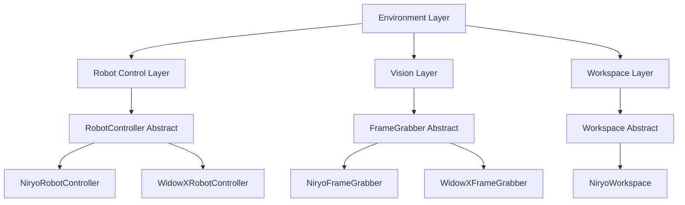
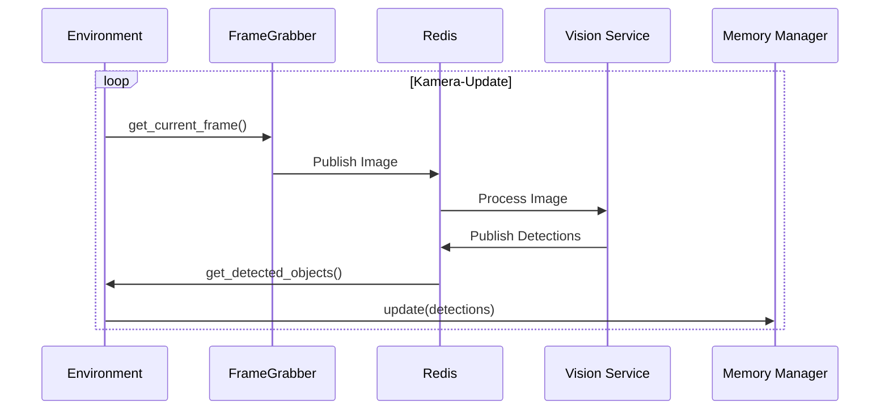

# Architektur

Dieses Dokument beschreibt die Systemarchitektur der Roboter-Umgebung.

## Systemübersicht

Die Roboter-Umgebung ist in mehreren Schichten aufgebaut, um eine klare Trennung der Zuständigkeiten zu gewährleisten.

## Komponenten

### Environment Layer
Der `Environment`-Zentralorchestrator koordiniert alle Subsysteme. Er verwaltet den Objektspeicher (`ObjectMemoryManager`) und stellt sicher, dass Kamera-Updates und Roboterbefehle thread-sicher ausgeführt werden.

### Robot Control Layer
Stellt eine High-Level-API für Pick-and-Place-Operationen bereit. Die abstrakte Klasse `RobotController` ermöglicht die Unterstützung verschiedener Hardware-Backends.

### Vision Layer
Verantwortlich für die Erfassung von Bildern und deren Streaming über Redis. Er integriert sich mit dem `vision_detect_segment`-Paket für die KI-gestützte Objekterkennung.

### Workspace Layer
Verwaltet die räumlichen Grenzen und bietet Transformationen zwischen Kamerakoordinaten (Pixel) und Weltkoordinaten (Meter).

## Datenfluss

Der folgende Diagramm zeigt den Datenfluss während eines typischen Update-Zyklus:

