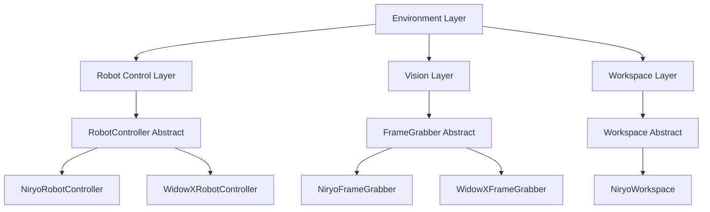
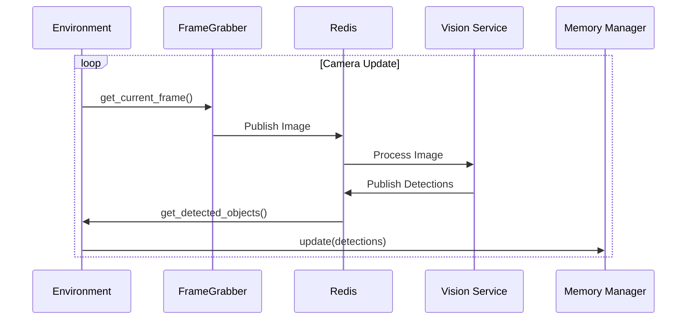

# Architecture

This document describes the system architecture of the Robot Environment.

## System Overview

The Robot Environment is built in several layers to ensure a clear separation of concerns.

## Components

### Environment Layer
The `Environment` central orchestrator coordinates all subsystems. It manages the object memory (`ObjectMemoryManager`) and ensures that camera updates and robot commands are executed in a thread-safe manner.

### Robot Control Layer
Provides a high-level API for pick-and-place operations. The abstract `RobotController` class allows support for different hardware backends.

### Vision Layer
Responsible for capturing images and streaming them via Redis. It integrates with the `vision_detect_segment` package for AI-powered object detection.

### Workspace Layer
Manages spatial boundaries and provides transformations between camera coordinates (pixels) and world coordinates (meters).

## Data Flow

The following diagram shows the data flow during a typical update cycle:

